# Book a Doc Web Application

## Tables of Contents

1. [Introduction](#introduction)  
2. [Entity Relationship Diagram ](#entity-relationship-diagram)  
    - [Entities, Relationships, and Foreign Keys](#entities-relationships-foreign-keys)  
3. [Features and Functions](#features-and-functions)  
4. [Programming Paradigm](#programming-paradigm)  
    - [Imperative programming](#imperative-programming)  
        - [Procedural programming](#procedural-programming)  
        - [Object oriented programming](#object-oriented-programming)
    - [Declarative programming](#declarative-programming)  
        - [Functional programming](#functional-programming)    
        - [Logic programming](#logic-programming)  
5. [Software Architecture Pattern](#software-architecture-pattern)  
    - [Layer Architecture](#layer-architecture)
    - [Model View Controller](#model-view-controller) 
    - [Event Driven Architecture ](#event-driven-architecture) 
6. [Project Management Methodology](#project-management-methodology)  
    - [Agile](#agile)  
    - [Kanban](#kanban)  
7. [Task Management Methodology](#task-management-methodology)    
8. [Client/Server Architecture Fundamentals and Implementation](#client/server-architecture-fundamentals-and-implemention)   
    - [Client/Server Communication](#client/server-communication)   
    - [Data Distribution](#data-distribution) 
    - [Data Security](#data-security)   
    - [Feature Distribution](#feature-distribution)    
    - [Authorisation and Authentication](#authorisation-and-athentication) 
    - [Validation](#validation) 
9. [User Stories for Book A Doc](#user-stories-for-book-a-doc)  
10. [Database System](#database-system)  

## Introduction

My Book A Doc application is designed to make booking GP appointments quick and easy. Patients can sign up or login to book and manage their appointments.   
The application allows patients to search available doctors and medical centres without having an account. However, if the patient wishes to make a booking, upon clicking the book button the system will direct the patient to either sign up or sign in to continue with the booking.

## Features and Functions

- Sign up & Login:  
    - Patients can create an account to book and manage their appointments. 

- Search for Doctors and Medical Centres: 
    - Users can find GPs based on specialty, availability, and medical centre location. 

- Appointment Booking: 
    - Logged in patients can select a doctor, choose a time, and book instantly. 

- Appointment Management: 
    - Patients can view their upcoming appointments with the option to cancel and past appointments, along with the appointment status (confirmed, completed, or cancelled).

- Medical Centre Details: 
    - Displays Doctor’s name, specialties, medical centre, availability, and booking button. 

## Programming Paradigm

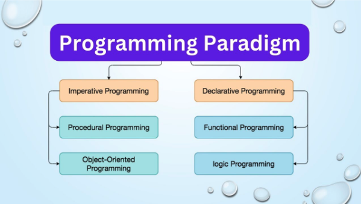

A programming paradigm is a way of thinking about and structuring code. It’s a set of principles, patterns, and styles that guide how developers write and organise programs.
Different paradigms influence how developers solve problems, structure data, and manage the flow of logic in the application.  
There are two types of programming paradigm:  

1. **Imperative programming:** code is written as a sequence of instruction that changes the program's state step by step  
- **Procedural programming:**  
    - organised into procedures or functions that manipulate data for reusability
- **Object oriented programming:**   
    - organised around objects that contain data and code. Uses:  
        - Encapsulation: bundle data and methods that operate on that data    
        - Inheritance: create new classes based on existing ones  
        - Polymorphism: same interface but different implementations  
        - Abstraction: hide complex implementation details  
2. **Declarative programming:** describes what needs to be done and focuses on the output or result
- **Functional programming** Uses:
    - Pure functions: same input will always produce the same output  
    - Immutable: the data can not be changed once created
    - First class functions: the functions can be passed as arguments
    - Higher order functions: functions that can operate on other functions  
- **Logic programming:** set if principles that are based on facts and rules  

Since my Book A Doc system involves handling user requests, managing data, and ensuring smooth functionality. 
I will use a mix of paradigms:  
- **Imperative Programming** for step by step processes like authentication an database transactions
- **Procedural Programming** for structuring routes and handling requests in Express.js   

```bash
// validating input and checking Dr availability
function createBooking(req, res) {
    const { patientId, doctorId, date } = req.body;
}
```
- **Object oriented Programming** for managing patients, doctors and bookings using Mongoose models   

```bash
// define schemas and models to represent Patient entity
const Patient = new mongoose.Schema ({
    name: String,
    dateOfBirth: Date
    email: String
    password: String    
})
```
- **Declarative Programming** for MongoDB queries

```bash
Doctor.find({ specialty: "Women's Health", available: true });
```
- **Functional Programming** for writing reusable utility functions

```bash
// formatting dates
const formatDate = (date) => newDate(date).isISOString() .split("T")[0]
```

## Software Architecture Pattern

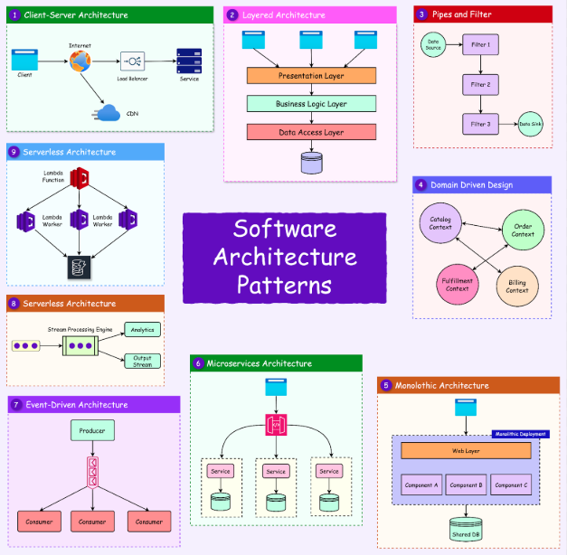

A software architecture pattern is a general structure or blueprint that defines how components of an application interact with each other.  
It provides a framework for organising an application's codebase, and helps developers organise code in a way that is scalable, maintainable, efficient.  
Common architectural patterns:  

- **Monolithic Architecture** a single tightly integrated codebase    
- **Layered (N-Tier) Architecture** separates an application into logical layers    
- **Model View Controller** separates concerns into Models, Views and Controllers  
- **Microservices Architecture** divides the application into small, independent services    
- **Event Driven Architecture** components communicate by triggering an responding to events  
- **Serverless Architecture** uses cloud-base functions instead of managing servers    

My Book A Doc system will follow the layer architecture, model view controller and event driven architecture.

### Layer Architecture

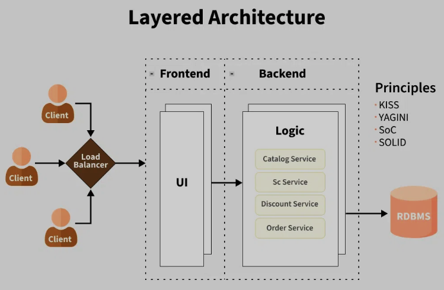

A layered architecture separate an application into different layers, each handling a specific part of the system. 
In my application, I will have:

- Presentation Layer (Frontend in the future)  
    - handles user interaction (UI)  
    - displays available doctors, medical centres, and bookings   

```bash
// route/bookingRoutes.js
const express = require("express");
const router = express.Router();
const bookingController = require("../controllers/bookingController");

// Create a new booking
router.post("/", bookingController.createBooking);

// Get all bookings
router.get("/", bookingController.getBookings);

module.exports = router;
```  

- Application Layer (Express.js API)   
    - process user requests such as login and book an appointment  
    - ensure business logic is executed correctly  
- Data Layer (MongoDB)  
    - manages the database  
    - stores patients, doctors and bookings   

### Model View Controller (MVC)

[MVC Diagram](images/mvc_pattern.png)

I will structure my Express.js using the MVC pattern:  
- Model  
    - handles database interaction using Mongoose models. For example, Patient, Doctor, and Booking models define data structures
- View  
    - all the UI logic of the application. For example, text box, search bar, book button, etc   
- Controller
    - manages request handling and business logic. For example bookingController.js would process booking requests, checks doctors availability, and saves appointments     

### Event Driven Architecture   

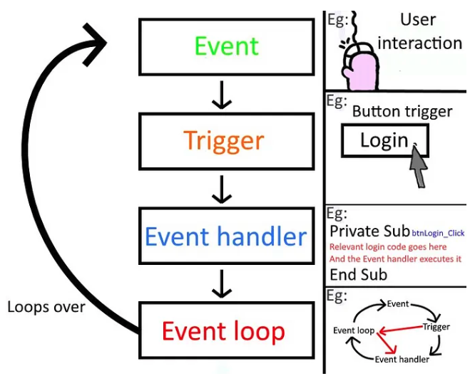

I will use event driven architecture to handle and respond to API requests:  

```bash
// handles booking when patient submits a booking request
app.post("/bookings", (req, res) => {})
```

## Project Management Methodology

[Project Management Methodology Diagram](images/project_management_methodology.png)

A project management methodology is a structured framework that guides the planning, execution, and completion of a project.   
It defines the processes, roles, and workflows for teams to follow to ensure efficiency, collaboration, and successful delivery.  
Common project management methodologies:    

- **Waterfall** a linear, step by step approach where each phase must be completed before moving to the next  
- **Agile** a flexible, iterative approach that encourages collaboration and adapting to change  
- **Scrum** a framework under Agile that organises work into short cycle sprints
- **Kanban** a visual workflow method that manages work using a board with tasks at different stages
- **Lean** a methodology focused on minimising waste and maximising value    

Since my Book A Doc system is a solo project, I need a methodology that is allows flexibility while keeping progress structured.   
To manage this project I will apply the agile and kanban methodology.   

### Agile

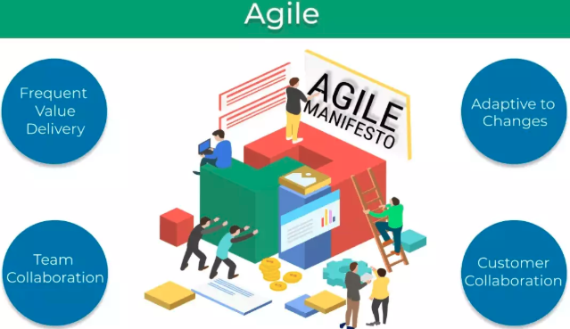

Agile focuses on continuous development and improvement, making it a good fit for a coding project where requirements might evolve.  
I will use the following agile principles:  

- **Iterative Development** building the system in small, testable parts instead of all at once     
- **Frequent Testing** continuously testing component like user authentication and booking logic  
- **Feedback Driven Improvements** adjusting based on testing results or feedback from my peers  

For example, instead of completing the entire system before testing, I would:  
1. develop user authentication - test and refine  
2. add booking functionality - test again before moving to the next feature  
3. improve based on feedback  

### Kanban

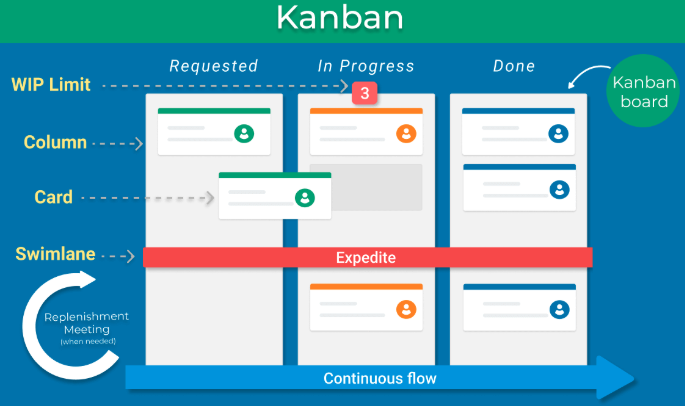

A kanban board is a simple and effective way to manage tasks. It consists of columns representing different stages of work.     
Each task moves from left to right as your work progresses. The visual layout helps to identify bottleneck and ensure tasks are completed efficiently.    
To keep track of my progress, I will use the kanban methodology to orgainse tasks into visual categories like:  

- To Do - eg. set up database models 
- In Progress  - eg. plan and design documentation
- Completed  - eg. ERD   

## Task Management Methodology  

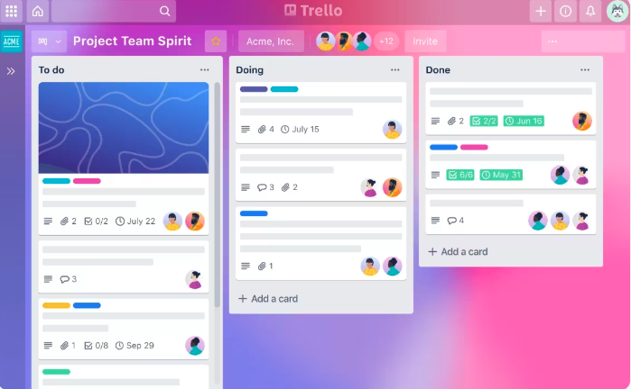

A task management methodology is a structured approach to planning, organising, tracking, and completing tasks efficiently. It ensures tasks are prioritised, dependencies are managed, and work is completed within deadlines.  

Task management is crucial in software development, where multiple tasks, like writing code, testing, debugging, and deploying need to be handled systematically. By following  a structures methodology, developers can break down large projects into manageable pieces, track progress, and ensure timely completion.  

I will be using Trello to manage tasks for my Book A Doc system, I can take advantage of its kanban style board, which allows me to visually track
progress, and prioritise tasks. Each task will be created as a Trello card that I can move across these columns as work progresses. For example:

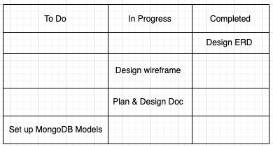

## Client/Server Architecture Fundamentals and Implementation  

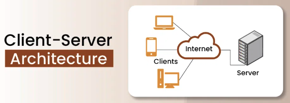

Client/server architecture is computing model in which multiple clients (users or devices) communicate with a server (central system) over a network. The server provides services like processing requests, storing data, and managing authentication, while the client handles user interactions.  

This architecture is widely used in web applications, mobile apples, and cloud-based platforms. My Book A Doc system follows this model, where a frontend client communicates with the backend server (Node.js, Express.js, MongDB).  

### Client/Server Communication

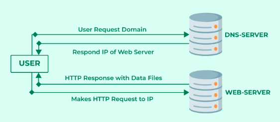

Client and server communication happens using HTTP or HTTPS request via RESTful APIs or WebSockets. 
In my Book A Doc system, the client (user interface) will send requests to the server to:

- fetch available doctors and medical centres
- book an appointment
- authenticate user through sign up, login and logout

An example of client request to book an appointment:  

```bash
async function bookAppointment() 
    const response = await fetch("/api/bookings", {
        method: "POST",
        headers: {
            "Content-Type": "application/json"
        },
        body: JSON.stringify ({
            patientId: "17",
            doctorId: "5",
            date: "2025-02-10"
        })
    });
```

An example of the server response:  

```bash
{
    "message": "Confirmed",
    "booking": {
        "patient": 17,
        "doctor": 5,
        "date": ""2025-02-10
    }
}
```

### Data Distribution

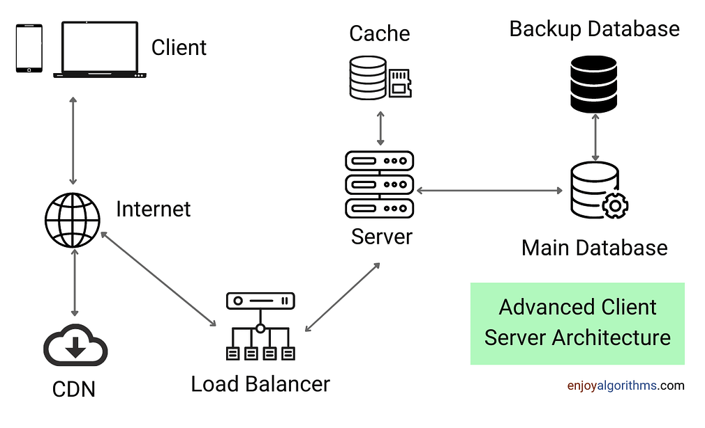

In client/server architecture, data can be stored and processed in different ways to optimise performance and security:  

1. **centralised storage:** data is stored on the server like MongoDB    
2. **cached Data:** frequently accessed data like doctor lists is cached to improve performance    
3. **client side storage:** the client may store small amounts of data like authentication tokens in local storage  

How my Book A Doc system will handle data distribution:  

- patient, doctor, and booking data is stored in MongoDB on the server  
- session tokens for logged-in users are stored on the client local storage. For example, when a user searches for doctors, the frontend may cache results so that repeated searches load faster  
- cached API responses can be used for static data like list of specialties for doctors. For example, when a user logs in, their session token is stored in local storage for authentication    


### Data Security

Data security protects confidential information from the unauthorised access, theft, or corruption.  
How my Book A Doc system ensure data security:  

- **encryption:** passwords are hashed with bcrypt before storage
- **HTTPS communication:** all API calls use HTTPS to encrypt data in transit
- **role based access control (RBAC):** patients cannot access other user's booking
- **cross origin resource sharing (CORS):** controls which clients can access my API
- **data security:** sensitive fields such as passwords are never stored in plain text

An example of password hashing with bcrypt.js  

```bash
const bcrypt = require("bcrypt");

const hashPassword = async (password) => {
    const salt = await bcrypt.genSlat(10);
    return await bcrypt.hash(password, salt);
};
```  

### Feature Distribution

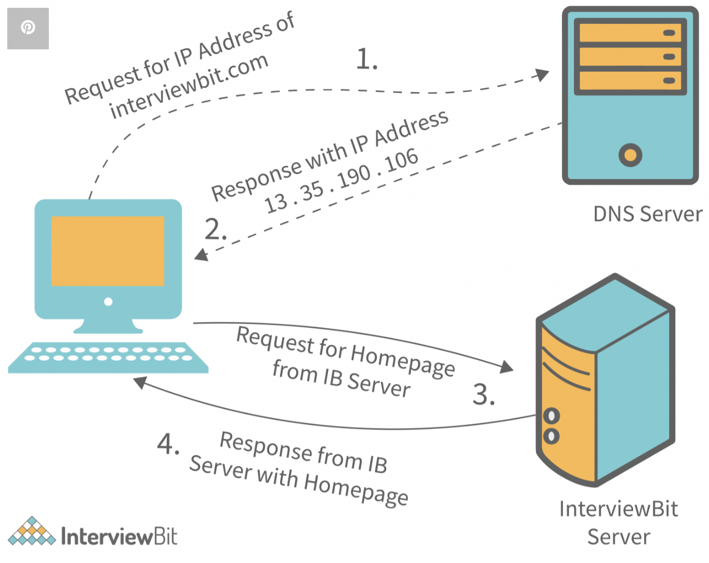    
 
Feature distribution refers to which tasks are handled by the client vs the server.    
How my Book A Doc system will distribute features:    

- **Client-side Frontend** UI display, basic validation, sending requests  
- **Server-side Backend** database operations, authentication, business logic  

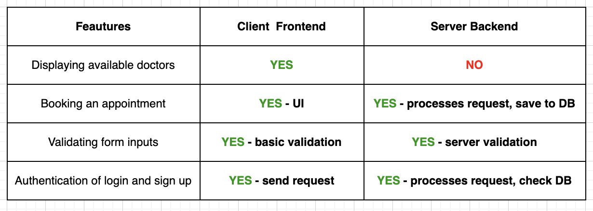  

### Authorisation and Authentication  

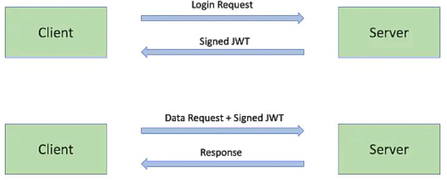  

Authorisation and authentication ensure secure access control:

- **Authorisation:** verifies who a user is through login with email and password
- **Authentication:** determines what a user can do. For example in my Book A Doc system, only a logged in patient can book an appointment.

How my Book A doc system will handle authorisation and authentication: 

1. **user logs in:** sends credentials to /api/auth/login
2. **server verifies credentials:** if correct, it issues a JWT token
3. **user accesses protected routes:** the client includes the JWT token is future requests
4. **server verifies token:** if valid, it allows access

A code example:  

```bash
const jwt = require("jsonwebtoken")

const User = require("../models/user")

const checkIfAdmin = async (req, res, next) => {
    let token = req.get("authorization") // Bearer the-actual-token
    token = token?.split(" ")?.[1] // the-actual-token
    if (!token) {
        return res.status(401).json({ error: "Unauthenticated" })
    }
    try {
        const payload = jwt.verify(token, "secret")
        const user = await User.findById(payload.id)
        if (!user.is_admin) {
            throw new Error()
        }
        req.userId = payload.id
        next()
    } catch(err) {
        console.log(err)
        return res.status(401).json({ error: "Unauthenticated / not an admin" })
    }
}

module.exports = checkIfAdmin
```

### Validation  

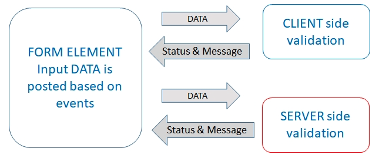    

Validation ensures data integrity and security by preventing incorrect or malicious input. It occurs on both the client and server.   

- Client-side Validation:
    - checks basic input before sending data to the server, eg. email format
    - improves user experience by providing instant feedback. For example:  

```bash
function validateEmail(email) {
    return email.includes("@") ? true : "Invalid email format";
}
```
- Server-side Validation:  
    - ensures data meets strict requirements before being stored    
    - prevents security vulnerabilities like     

How my Book A doc system uses validation:    

- **client-side validation** for instant feedback eg. highlighting incorrect form fields    
- **server-side validation** for security & data integrity eg. ensuring valid doctor IDs in booking  

## User Stories for Book A Doc

1. Patient user stories:  
- as a patient, I want to create an account so that I can book and manage my appointments securely
    - only registered users should be able to book appointments, ensuring patient information is stored securely
as a patient, 
2. Doctor user stories
3. Admin user stories