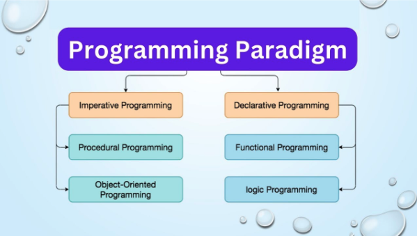

# Book a Doc Web Application

## Tables of Contents

1. [Introduction](#introduction)  
2. [Entity Relationship Diagram ](#entity-relationship-diagram)  
    - [Entities, Relationships, and Foreign Keys](#entities-relationships-foreign-keys)  
3. [Features and Functions](#features-and-functions)  
4. [Programming Paradigm](#programming-paradigm)  
5. [Software Architecture Pattern](#software-architecture-pattern)  
    - [Virtual Environment Set Up](#virtual-environment-set-up)
    - [Packages](#packages)  
6. [Set Up](#set-up)  
    - [PostgreSQL](#postgreSQL)  
    - [zsh](#zsh)  
7. [Deployment](#deployment)    
8. [Testing](#testing)    
    - [API Endpoints](#api-endpoints)  
9. [License](#license)  
10. [Database System](#database-system)  

## Introduction

My Book A Doc application is designed to make booking GP appointments quick and easy. Patients can sign up or login to book and manage their appointments.   
The application allows patients to search available doctors and medical centres without having an account. However, if the patient wishes to make a booking, upon clicking the book button the system will direct the patient to either sign up or sign in to continue with the booking.

## Features and Functions

- Sign up & Login:  
    - Patients can create an account to book and manage their appointments. 

- Search for Doctors and Medical Centres: 
    - Users can find GPs based on speciality, availability, and medical centre location. 

- Appointment Booking: 
    - Logged in patients can select a doctor, choose a time, and book instantly. 

- Appointment Management: 
    - Patients can view their upcoming appointments with the option to cancel and past appointments, along with the appointment status (confirmed, completed, or cancelled).

- Medical Centre Details: 
    - Displays Doctor’s name, specialties, medical centre, availability, and booking button. 

## Programming Paradigm



A programming paradigm is a way of thinking about and structuring code. It’s a set of principles, patterns, and styles that guide how developers write and organise programs.
Different paradigms influence how developers solve problems, structure data, and manage the flow of logic in the application.

1. **Imperative programming:** code is written as a sequence of instruction that changes the program's state step by step  
- **Procedural programming:**  
    - organised into procedures or functions that manipulate data fir reusability
- **Object oriented programming:**   
    - organised around objects that contain data and code. Uses:  
        - Encapsulation: bundle data and methods that operate on that data    
        - Inheritance: create new classes based on existing ones  
        - Polymorphism: same interface but different implementations  
        - Abstraction: hide complex implementation details  
2. **Declarative programming:** describes what needs to be done  
- **Functional programming** Uses:
    - Pure functions: same input will always produce the same output  
    - Immutable: the data can not be changed once created
    - First class functions: the functions can be passed as arguments
    - Higher order functions: functions that can operate on other functions  
- **Logic programming:** set if principles that are based on facts and rules  

Since my GP booking system involves handling user requests, managing data, and ensuring smooth functionality. 
I will use a mix of paradigms:  
- **Imperative Programming** for step by step processes like authentication an database transactions
- **Procedural Programming** for structuring routes and handling requests in Express.js  
```bash
// validating input and checking Dr availability
function createBooking(req, res) {
    const { patientId, doctorId, date } = req.body;
}
```
- **Object oriented Programming** for managing patients, doctors and bookings using Mongoose models  
```bash
// define schemas and models to represent Patient entity
const Patient = new mongoose.Schema ({
    name: String,
    dateOfBirth: Date
    email: String
    password: String    
})
```
- **Event Driven Programming** for handling API requests
```bash
// handles booking when patient submits a booking request
app.post("/bookings", (req, res) => {})
```
- **Declarative Programming** for MongoDB queries  
```bash
Doctor.find({ specialty: "Women's Health", available: true });
```
- **Functional Programming** for writing reusable utility functions
```bash
// formatting dates
const formatDate = (date) => newDate(date).isISOString() .split("T")[0]
```

## Software Architecture Pattern

A software architecture pattern is a general structure or blueprint